# Claude Analytics Platform - Architecture Document

> **Version**: 1.0.0
> **Last Updated**: January 2026
> **Status**: Production

## Table of Contents

1. [Executive Summary](#1-executive-summary)
2. [System Overview](#2-system-overview)
3. [Data Architecture](#3-data-architecture)
4. [Component Architecture](#4-component-architecture)
5. [Infrastructure Architecture](#5-infrastructure-architecture)
6. [Data Model](#6-data-model)
7. [Orchestration & Scheduling](#7-orchestration--scheduling)
8. [Data Quality Framework](#8-data-quality-framework)
9. [Deployment Architecture](#9-deployment-architecture)
10. [Security Architecture](#10-security-architecture)
11. [Operational Procedures](#11-operational-procedures)
12. [Design Patterns & Principles](#12-design-patterns--principles)

---

## 1. Executive Summary

The **Claude Analytics Platform** is an enterprise-grade ELT (Extract, Load, Transform) analytics system that processes Claude Code conversation logs from MongoDB into a DuckDB OLAP database, applying dimensional modeling via dbt, and visualizing insights through Metabase.

### Key Capabilities

| Capability | Technology | Purpose |
|------------|------------|---------|
| **Extraction** | Python + PyMongo | Extract conversation logs from MongoDB |
| **Storage** | Parquet + DuckDB | Columnar storage for OLAP workloads |
| **Transformation** | dbt | Medallion architecture (Bronze → Silver → Gold) |
| **Orchestration** | Prefect 2.x | Scheduled and ad-hoc pipeline execution |
| **Data Quality** | Great Expectations | Validation at multiple pipeline stages |
| **Visualization** | Metabase | Self-service BI dashboards |

### Technology Stack

```
┌─────────────────────────────────────────────────────────────┐
│                    VISUALIZATION LAYER                       │
│                  Metabase (Custom DuckDB)                    │
├─────────────────────────────────────────────────────────────┤
│                   TRANSFORMATION LAYER                       │
│         dbt-core + dbt-duckdb (Medallion Architecture)      │
├─────────────────────────────────────────────────────────────┤
│                      STORAGE LAYER                           │
│              DuckDB (OLAP) + Parquet Files                  │
├─────────────────────────────────────────────────────────────┤
│                   ORCHESTRATION LAYER                        │
│              Prefect 2.19 + PostgreSQL Backend              │
├─────────────────────────────────────────────────────────────┤
│                    EXTRACTION LAYER                          │
│           Python 3.11 + PyMongo + PyArrow                   │
├─────────────────────────────────────────────────────────────┤
│                      SOURCE LAYER                            │
│               MongoDB (Conversation Logs)                    │
└─────────────────────────────────────────────────────────────┘
```

---

## 2. System Overview

### 2.1 High-Level Data Flow

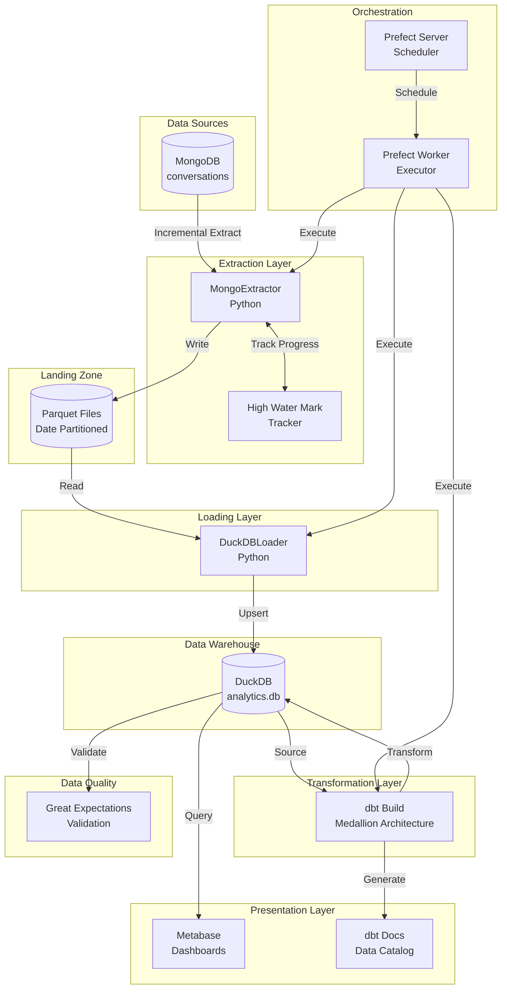

### 2.2 Component Interaction Diagram

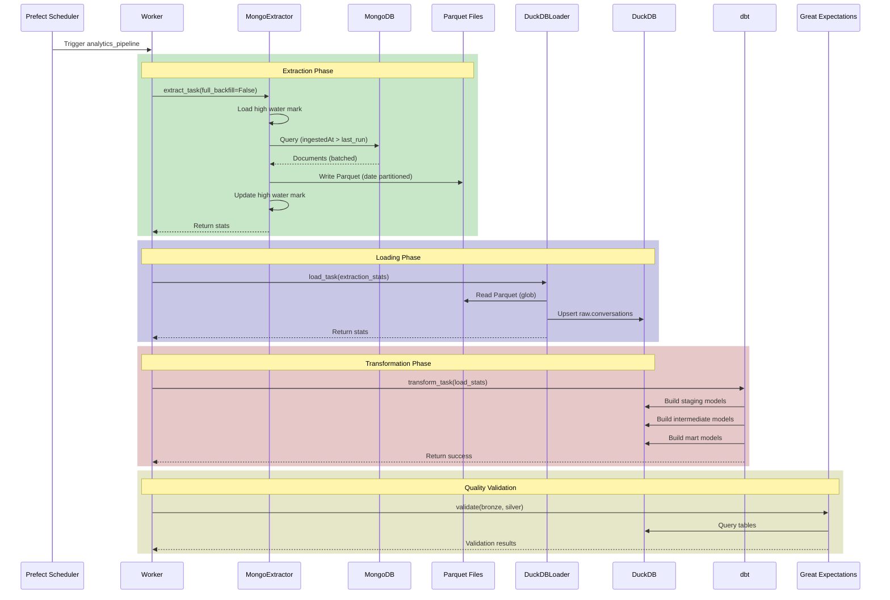

---

## 3. Data Architecture

### 3.1 Medallion Architecture (Bronze → Silver → Gold)

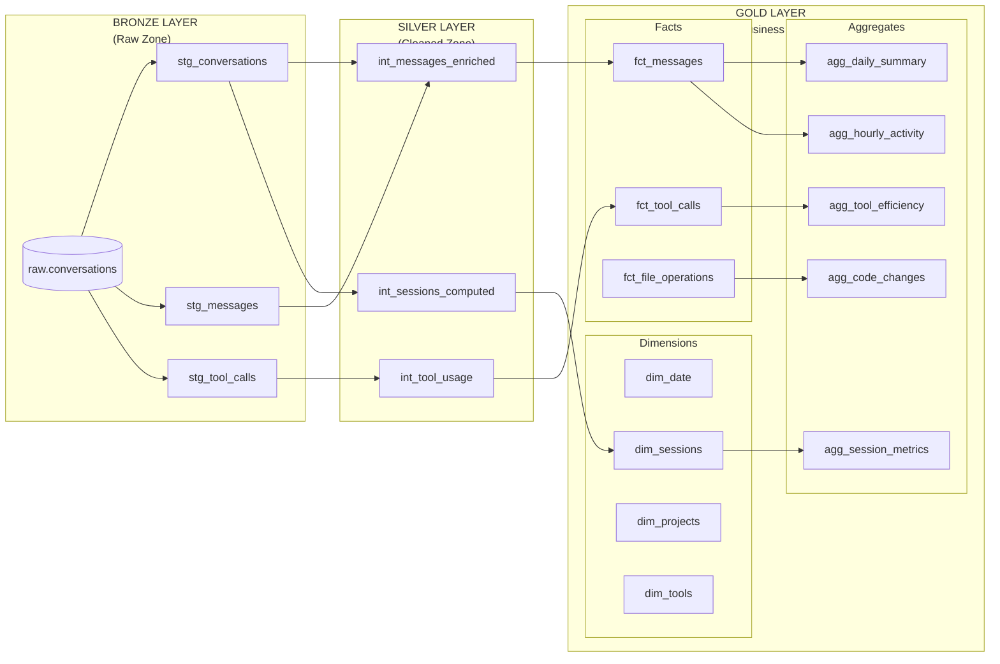

### 3.2 Layer Responsibilities

| Layer | Purpose | Materialization | Tests |
|-------|---------|-----------------|-------|
| **Bronze (Staging)** | Type casting, null handling, basic cleaning | VIEW | Schema tests |
| **Silver (Intermediate)** | Business logic, enrichment, computed fields | VIEW | Data quality |
| **Gold (Marts)** | Dimensional models, aggregations | TABLE | Business rules |

### 3.3 Data Lineage

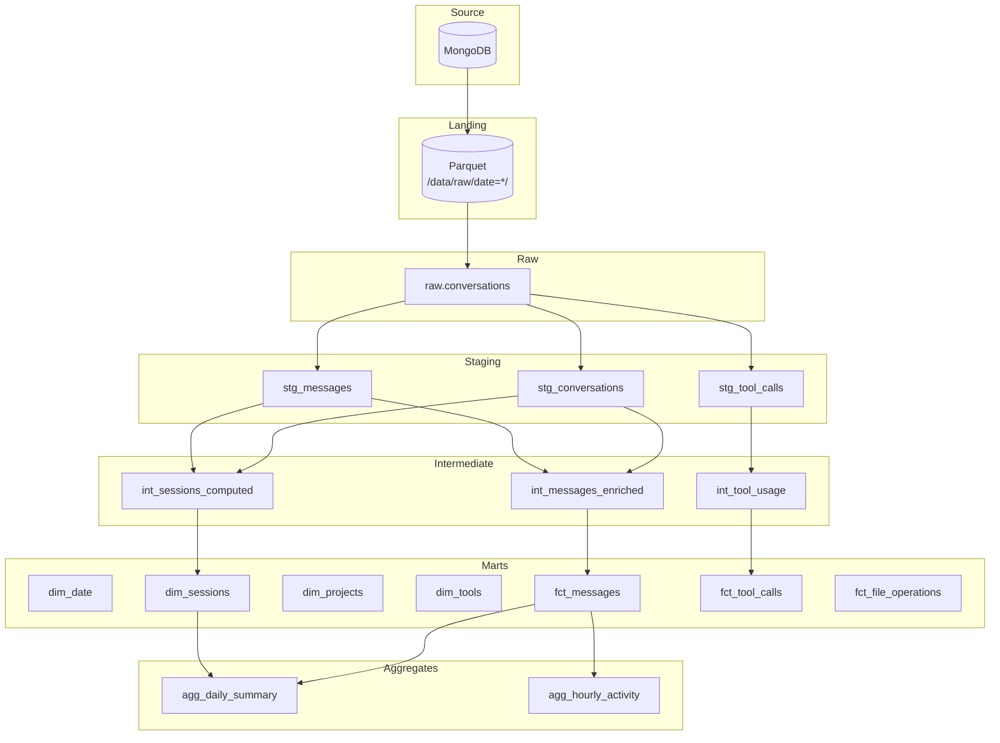

---

## 4. Component Architecture

### 4.1 Python Package Structure

```
analytics/
├── __init__.py                 # Package initialization
├── config.py                   # Pydantic settings management
├── extractor.py               # MongoDB → Parquet extraction
├── loader.py                  # Parquet → DuckDB loading
├── quality.py                 # Great Expectations integration
├── cli.py                     # Typer CLI interface
└── flows/
    ├── __init__.py
    ├── main_pipeline.py       # Prefect flow definitions
    └── deployment.py          # Deployment helpers
```

### 4.2 Module Responsibility Matrix

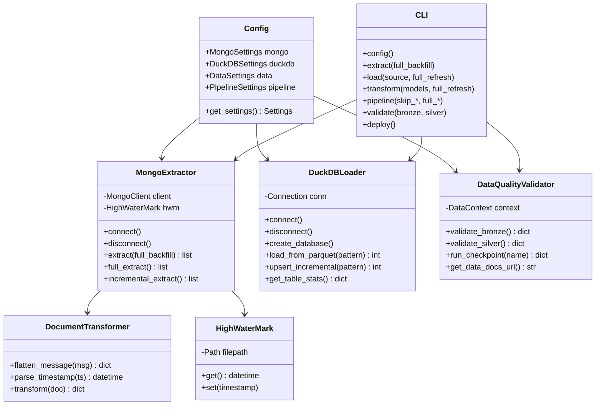

### 4.3 Extractor Component Detail

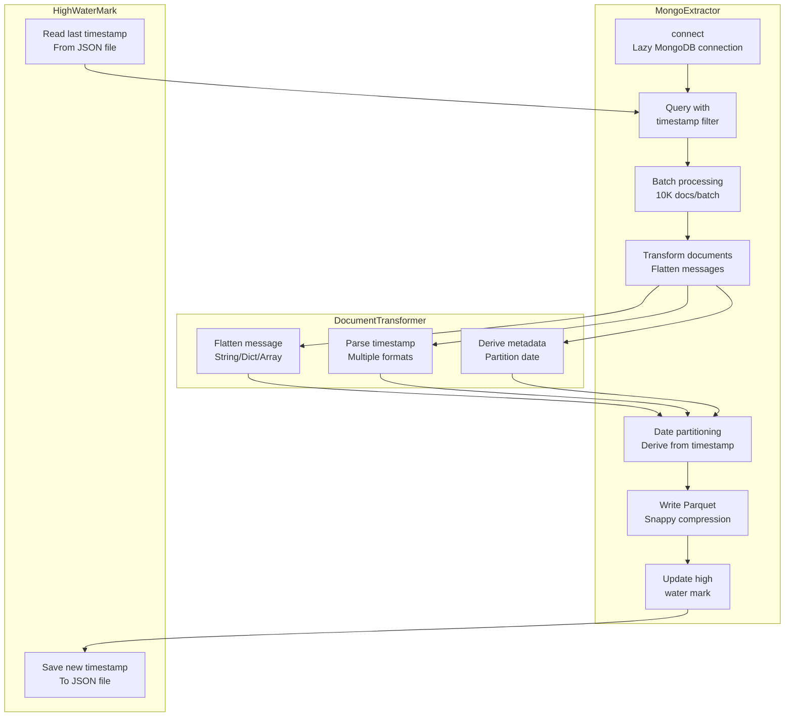

### 4.4 Loader Component Detail

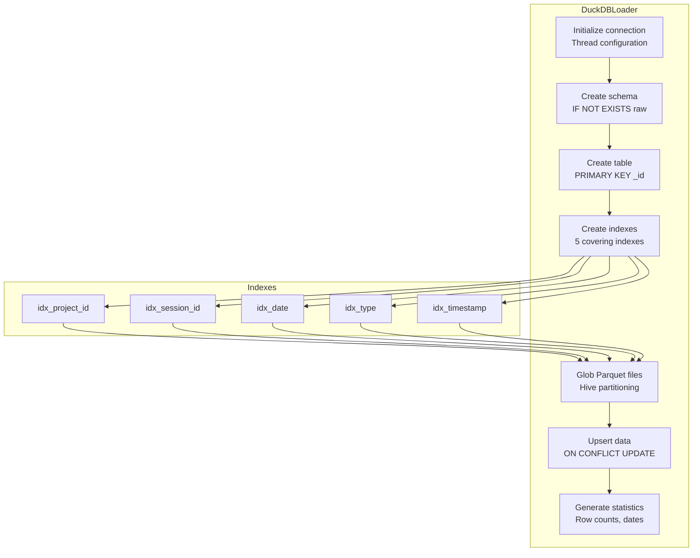

---

## 5. Infrastructure Architecture

### 5.1 Docker Service Topology

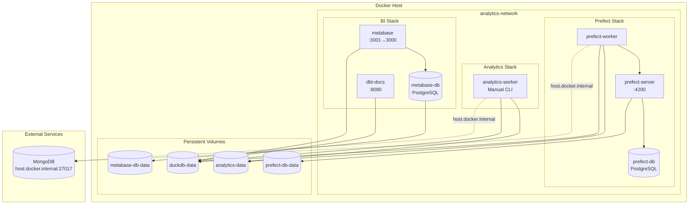

### 5.2 Service Configuration Matrix

| Service | Image | Port | Healthcheck | Dependencies |
|---------|-------|------|-------------|--------------|
| prefect-server | prefecthq/prefect:2.19-python3.11 | 4200 | HTTP /api/health | prefect-db |
| prefect-db | postgres:15-alpine | 5432 (internal) | pg_isready | - |
| prefect-worker | Custom (Dockerfile) | - | - | prefect-server |
| analytics-worker | Custom (Dockerfile) | - | - | - |
| metabase | Custom (metabase/Dockerfile) | 3001→3000 | HTTP /api/health | metabase-db |
| metabase-db | postgres:15-alpine | 5432 (internal) | pg_isready | - |
| dbt-docs | Custom (Dockerfile) | 8080 | - | - |

### 5.3 Container Build Architecture

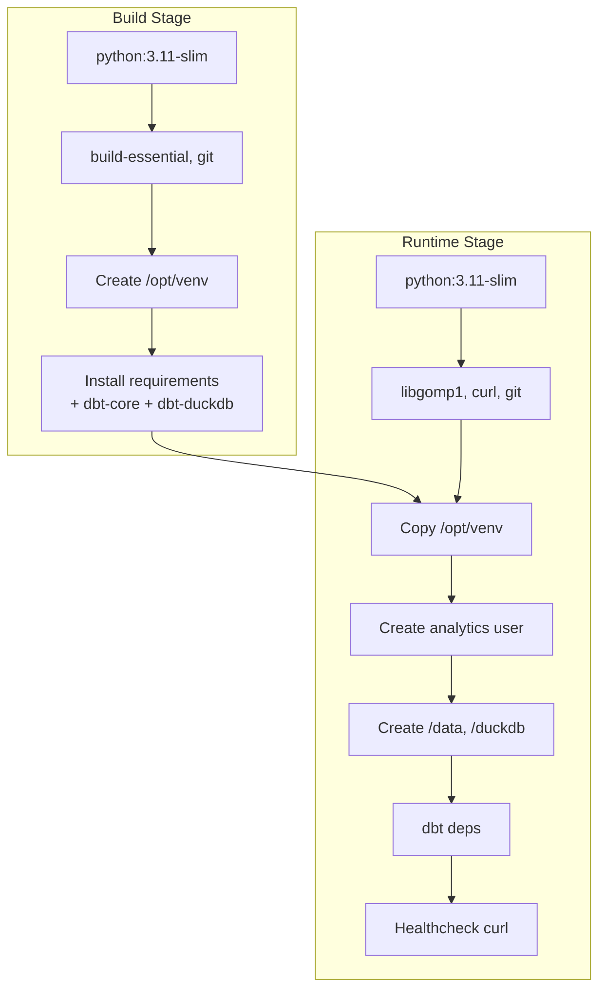

---

## 6. Data Model

### 6.1 Entity Relationship Diagram

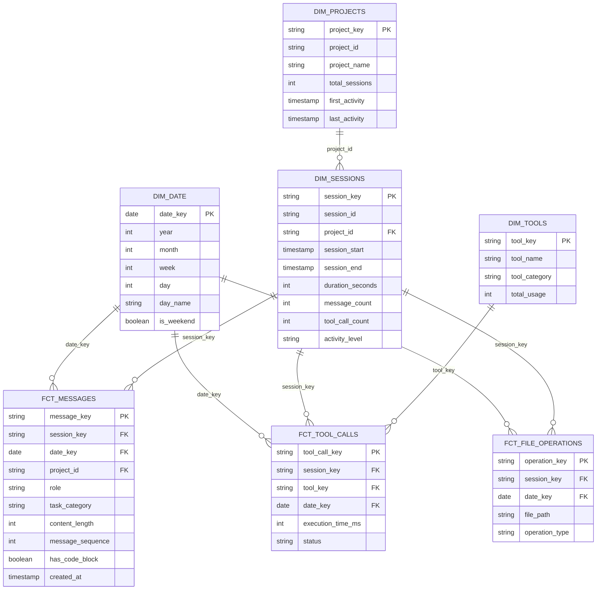

### 6.2 Raw Schema (Source)

```sql
-- raw.conversations
CREATE TABLE raw.conversations (
    _id VARCHAR PRIMARY KEY,           -- MongoDB ObjectId
    type VARCHAR,                       -- user, assistant, tool_use, tool_result
    session_id VARCHAR,                -- Session grouping
    project_id VARCHAR,                -- Project grouping
    timestamp TIMESTAMP WITH TIME ZONE,
    ingested_at TIMESTAMP WITH TIME ZONE,
    extracted_at TIMESTAMP WITH TIME ZONE,
    message_role VARCHAR,
    message_content VARCHAR,
    message_raw VARCHAR,               -- JSON for complex messages
    source_file VARCHAR,
    date DATE                          -- Partition key
);

-- Indexes
CREATE INDEX idx_conversations_project_id ON raw.conversations(project_id);
CREATE INDEX idx_conversations_session_id ON raw.conversations(session_id);
CREATE INDEX idx_conversations_date ON raw.conversations(date);
CREATE INDEX idx_conversations_type ON raw.conversations(type);
CREATE INDEX idx_conversations_timestamp ON raw.conversations(timestamp);
```

### 6.3 Aggregate Models

| Model | Grain | Key Metrics |
|-------|-------|-------------|
| **agg_daily_summary** | 1 row per day | sessions, messages, tools, duration |
| **agg_hourly_activity** | 1 row per hour | activity count (for heatmaps) |
| **agg_session_metrics** | 1 row per session | duration, messages, productivity |
| **agg_tool_efficiency** | 1 row per tool | usage, success rate, avg time |
| **agg_code_changes** | 1 row per day | files modified, operations |

---

## 7. Orchestration & Scheduling

### 7.1 Prefect Flow Architecture

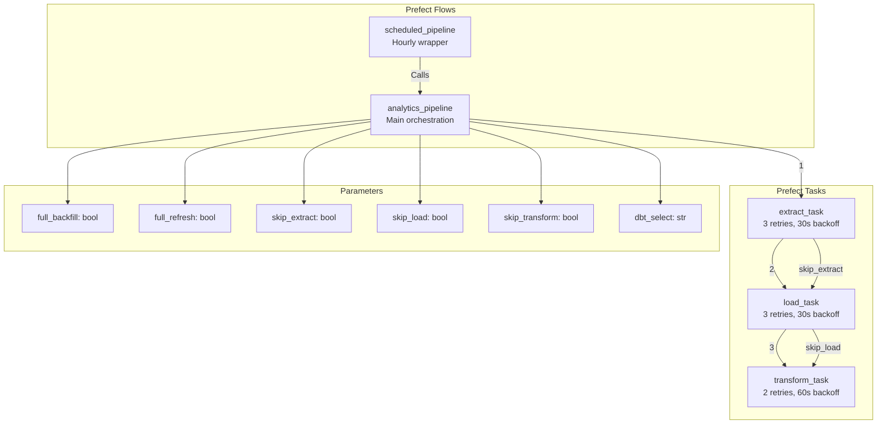

### 7.2 Deployment Schedule Matrix

| Deployment | Schedule | Parameters | Use Case |
|------------|----------|------------|----------|
| **hourly-analytics** | Every 1h | Defaults | Incremental sync |
| **daily-full-refresh** | 2:00 AM daily | full_refresh=true | Full rebuild |
| **adhoc-analytics** | Manual | Defaults | On-demand |
| **full-backfill** | Manual | full_backfill=true, full_refresh=true | Initial load |

### 7.3 Task Dependency Graph

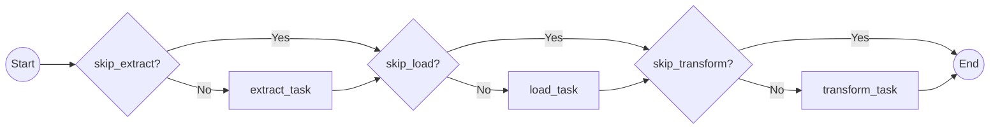

---

## 8. Data Quality Framework

### 8.1 Great Expectations Integration

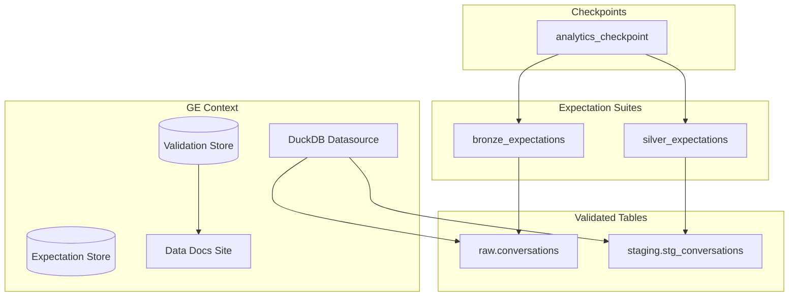

### 8.2 Validation Rules

**Bronze Layer (raw.conversations)**:

| Expectation | Column | Rule |
|-------------|--------|------|
| not_null | _id, type, date, extracted_at | Required fields |
| unique | _id | Primary key |
| value_set | type | ['user', 'assistant', 'tool_use', 'tool_result', 'unknown'] |
| between | content_length | 0 to 100,000 |

**Silver Layer (stg_conversations)**:

| Expectation | Column | Rule |
|-------------|--------|------|
| not_null | conversation_id, entry_type | Cleaned fields |
| format | effective_timestamp | Valid timestamp |
| referential | session_id | Exists in sessions |

### 8.3 dbt Test Strategy

| Test Type | Location | Purpose |
|-----------|----------|---------|
| **Schema tests** | _schema.yml | Column types, nullability |
| **Unique tests** | _schema.yml | Primary key validation |
| **Relationship tests** | _schema.yml | Foreign key validation |
| **Custom tests** | tests/*.sql | Business rule validation |
| **Freshness** | _sources.yml | SLA monitoring |

---

## 9. Deployment Architecture

### 9.1 Environment Configuration

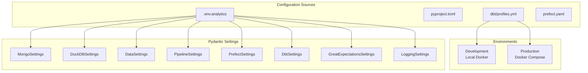

### 9.2 Key Environment Variables

| Variable | Default | Description |
|----------|---------|-------------|
| `MONGO_URI` | mongodb://localhost:27017 | MongoDB connection |
| `MONGO_DB` | claude_logs | Database name |
| `DUCKDB_PATH` | /duckdb/analytics.db | DuckDB file path |
| `DUCKDB_THREADS` | 4 (dev) / 8 (prod) | Parallelism |
| `BATCH_SIZE` | 10000 | Extraction batch size |
| `DBT_TARGET` | dev | dbt profile target |
| `PREFECT_API_URL` | http://localhost:4200/api | Prefect server |
| `LOG_LEVEL` | INFO | Logging verbosity |

---

## 10. Security Architecture

### 10.1 Security Layers

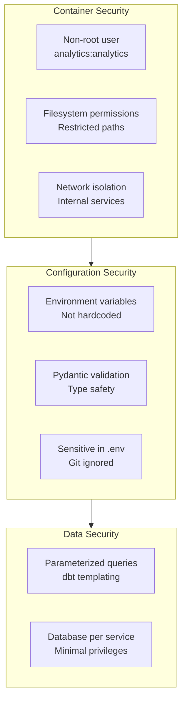

### 10.2 Security Controls

| Layer | Control | Implementation |
|-------|---------|----------------|
| **Container** | Non-root execution | USER analytics in Dockerfile |
| **Container** | Minimal base image | python:3.11-slim |
| **Network** | Internal services | Docker bridge network |
| **Config** | Secret management | Environment variables |
| **Config** | Type validation | Pydantic strict mode |
| **Data** | SQL injection prevention | dbt Jinja templating |
| **Data** | Credential storage | .env files (gitignored) |

---

## 11. Operational Procedures

### 11.1 Makefile Commands

```
┌─────────────────────────────────────────────────────────────┐
│                    INFRASTRUCTURE                            │
├─────────────────────────────────────────────────────────────┤
│ make up              Start all services                     │
│ make up-prefect      Start Prefect only (no Metabase)       │
│ make down            Stop all services                      │
│ make rebuild         Rebuild with --no-cache                │
│ make fresh           Full reset (down → rebuild → up)       │
│ make logs            Follow analytics-worker logs           │
│ make shell           Interactive shell in worker            │
├─────────────────────────────────────────────────────────────┤
│                     DEPLOYMENTS                              │
├─────────────────────────────────────────────────────────────┤
│ make deploy          Build, restart worker, deploy flows    │
│ make status          List Prefect deployments               │
├─────────────────────────────────────────────────────────────┤
│                   PIPELINE EXECUTION                         │
├─────────────────────────────────────────────────────────────┤
│ make run-adhoc       Run incremental pipeline               │
│ make run-backfill    Run full historical backfill           │
│ make run-daily       Run daily full refresh                 │
│ make pipeline        Run locally (without Prefect)          │
└─────────────────────────────────────────────────────────────┘
```

### 11.2 CLI Commands

```bash
# Configuration
claude-analytics config              # Display settings

# Extraction
claude-analytics extract             # Incremental
claude-analytics extract --full-backfill  # Full history

# Loading
claude-analytics load                # Load from default path
claude-analytics load --full-refresh # Truncate and reload
claude-analytics load --stats        # Show table statistics

# Transformation
claude-analytics transform           # Build all models
claude-analytics transform --models "staging.*"  # Specific models
claude-analytics transform --full-refresh  # Rebuild incremental

# Full Pipeline
claude-analytics pipeline            # Run all steps
claude-analytics pipeline --skip-extract  # Skip extraction
claude-analytics pipeline --prefect  # Via Prefect

# Data Quality
claude-analytics validate --bronze   # Validate raw layer
claude-analytics validate --silver   # Validate staging
claude-analytics validate --build-docs  # Generate HTML

# Deployment
claude-analytics deploy              # Deploy to Prefect
```

### 11.3 Monitoring Endpoints

| Endpoint | Port | Purpose |
|----------|------|---------|
| `http://localhost:4200` | 4200 | Prefect UI |
| `http://localhost:3001` | 3001 | Metabase dashboards |
| `http://localhost:8080` | 8080 | dbt documentation |
| `http://localhost:4200/api/health` | 4200 | Prefect health |
| `http://localhost:3001/api/health` | 3001 | Metabase health |

---

## 12. Design Patterns & Principles

### 12.1 Applied Patterns

| Pattern | Implementation | Benefit |
|---------|----------------|---------|
| **Single Responsibility** | Separate modules (extractor, loader, quality) | Maintainability |
| **Lazy Initialization** | Connections created on first use | Reduced startup time |
| **Immutable Configuration** | @lru_cache on settings | Thread safety |
| **Repository Pattern** | HighWaterMark for state | Testability |
| **Retry with Backoff** | Prefect task retries | Resilience |
| **Incremental Processing** | High water mark + dbt incremental | Efficiency |
| **Medallion Architecture** | Bronze → Silver → Gold | Data quality |

### 12.2 Error Recovery Strategy

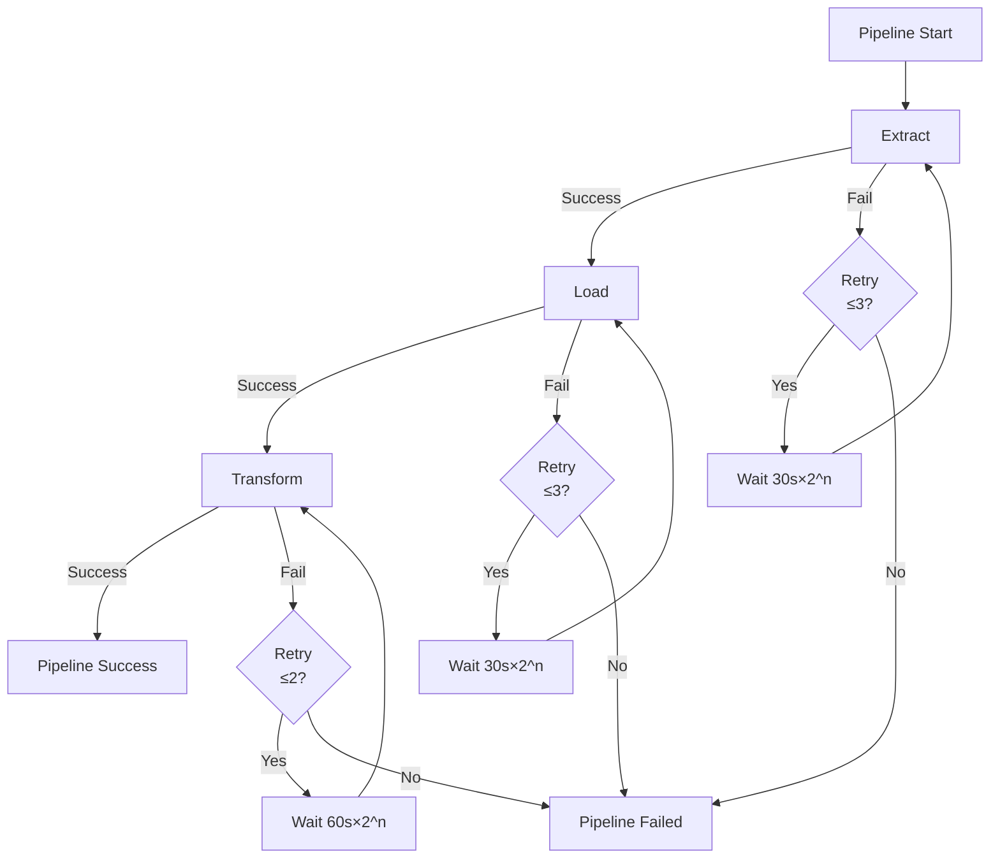

### 12.3 Scalability Considerations

| Aspect | Current | Scaling Path |
|--------|---------|--------------|
| **Data Volume** | Single DuckDB file | Partitioned tables |
| **Extraction** | Sequential batches | Parallel workers |
| **Transformation** | Single dbt process | dbt Cloud / parallel |
| **Orchestration** | Single work pool | Multiple pools |
| **Visualization** | Single Metabase | Load balancer |

---

## Appendix A: File Inventory

```
analytics/
├── analytics/                 # Python package
│   ├── __init__.py
│   ├── config.py             # Settings management
│   ├── extractor.py          # MongoDB extraction
│   ├── loader.py             # DuckDB loading
│   ├── quality.py            # Great Expectations
│   ├── cli.py                # CLI interface
│   └── flows/                # Prefect flows
│       ├── __init__.py
│       ├── main_pipeline.py
│       └── deployment.py
├── dbt/                      # dbt project
│   ├── dbt_project.yml
│   ├── profiles.yml
│   ├── packages.yml
│   └── models/
│       ├── staging/          # Bronze layer
│       ├── intermediate/     # Silver layer
│       └── marts/            # Gold layer
│           └── aggregates/
├── great_expectations/       # Data quality
│   ├── great_expectations.yml
│   ├── expectations/
│   └── checkpoints/
├── metabase/                 # Custom Metabase
│   └── Dockerfile
├── tests/                    # Python tests
│   └── test_extractor.py
├── Dockerfile               # Multi-stage build
├── docker-compose.analytics.yml
├── Makefile                 # Operations
├── prefect.yaml             # Deployment config
├── pyproject.toml           # Package metadata
├── requirements.txt         # Dependencies
└── README.md                # Documentation
```

---

## Appendix B: Quick Reference

### Start Development Environment
```bash
make up
make deploy
make run-backfill  # First time only
```

### Daily Operations
```bash
make status        # Check deployments
make logs          # Monitor execution
```

### Troubleshooting
```bash
make shell         # Enter container
claude-analytics config  # Verify settings
claude-analytics validate --bronze --silver  # Check data quality
```

---

*Document generated for Claude Analytics Platform v1.0.0*
